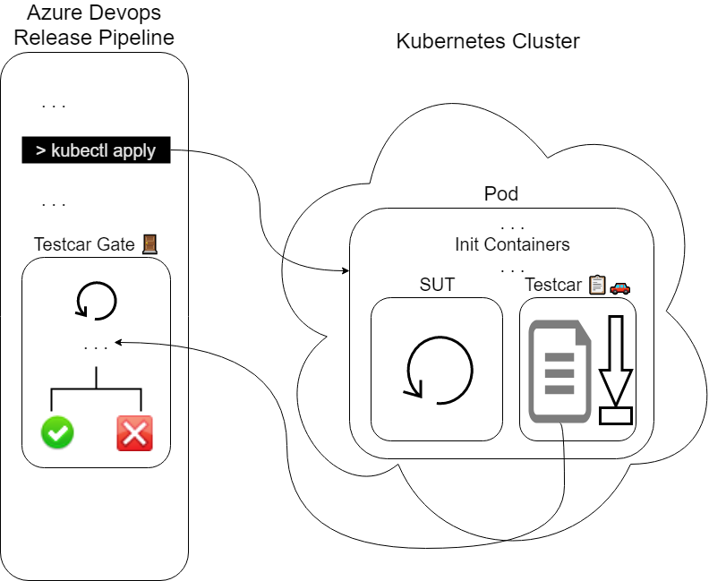

# Concepts

## Components
There are two main components to Testcar: The sidecar agent itself, and Testcar Gate, an Azure Devops (ADO) pipeline task.
### Testcar
[The sidecar](AGENT.md) is responsible for:
  * Discovery of tests
  * Execution of the tests against the System Under Test (SUT)
  * Reporting of results using standard Kubernetes patterns (i.e., stdout)
### Testcar Gate
[Testcar Gate](GATE.md) is responsible for:
  * Discovery of Testcar instance
  * Polling Testcar's K8s logs for test results
  * Delaying the release pipeline until logging of test results is complete
  * Passing or Failing an ADO release based on the results of testing
  * Providing a human-readable reason in the case of failure (e.g., just pasting the logs directly from Testcar)
